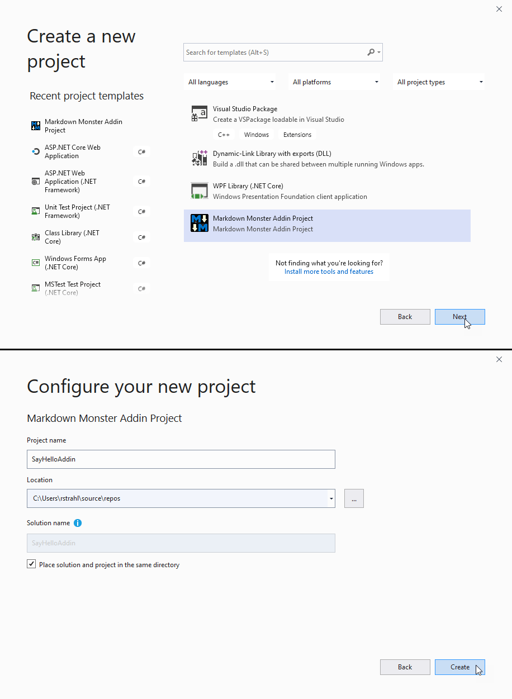

# Markdown Monster Addin Project Visual Studio Template

### Create new Markdown Monster Addins From Visual Studio
This project contains the code for a Visual Studio project template to create a new Markdown Monster Addin.

You can install the VSIX template from within the [Visual Studio Extension Manager](https://marketplace.visualstudio.com/vsgallery/231f13cc-2348-432c-a69f-82e7b725587e), or from the [VSIX template from this project](https://github.com/RickStrahl/MarkdownMonsterAddinProjectTemplate/raw/master/MarkdownMonsterAddinProjectVsix/bin/Release/MarkdownMonsterAddinProjectTemplate.vsix).

> #### @icon-warning Requires .NET 4.7.2
> Markdown Monster Addins have to be built against .NET 4.7.2 as that is the base version that Markdown Monster is built against. The dependencies in the addin project require the same runtime level in order to bind to the host assembly.

### Additional Resources
* [Creating a Markdown Monster Addin](http://markdownmonster.west-wind.com/docs/_4ne0s0qoi.htm)
* [Markdown Monster](https://github.com/rickstrahl/MarkdownMonster)
* [Markdown Monster Addin Repository](https://github.com/RickStrahl/MarkdownMonsterAddinsRegistry)
* [Markdown Monster Addin Project in the Visual Studio Gallery](https://marketplace.visualstudio.com/vsgallery/231f13cc-2348-432c-a69f-82e7b725587e)

